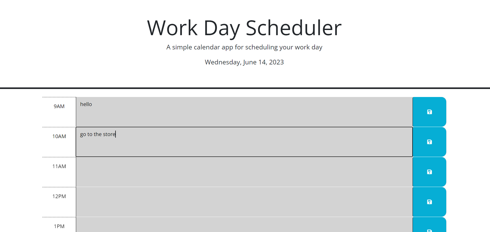

# Daily_Event_Planner_Challenge_5

## Website Link

https://matthewlazarowitz.github.io/Daily_Event_Planner_Challenge_5/

## Screenshot

## Description

For this challenge we were tasked with using starter code to completely fill out the Javascript for a daily event planner.  In this the js file the goal was to add the abilities to: display the current date in the header, take the events saved by the user and store them in local storage, a retrieve that information, consitantly display the events even when the page is refreshed, and finally show the current/past/future hours via color codes ont the time blocks.  This task tested our ability to different Javascript tools we had learned in class such as JSON, jQuery, and using third party API's. The other challenges were practcing using other skills we have used previously such as: if statements, else, functions etc. I used many functions in order to accomplish this feat.  After wrapping the DOM in jQuery I set variables for elements in functions I was going to define.  The functions I used were: "displayCurrentDay" in this function I used the jQuery defined variable currentDayEl and variable currentDay to actually add the date to the header to the page, "getEvents" is a function to retrieve the events made by users through local storage by parsing the JSON string and returning this value, "saveEvent" I set getEvents to a variable to retrieve old events objects then updated it to the specified hour then stored this update to local storage, "updateColor" to update the timeblocks color based on the time of day by using getting the current hour using Day.Js then looping to each time block and removing existing colors then finally set an if statment to check the current hour and color it based on the past present and future through else.  Lastly I added save functionality to the save buttons, and ran calls to load saved events from local storage, update colors, and for date dispalay.

## Installation

N/A

## Usage

The application is the first fully usable app we have designed in the course!  Previously we had desined more static webpages, but this is an app through and through.  I could one hundred percent use this in my week as a function planner to list out events.  As well it could be shown to any user for the same purpose.   

## Credits

(JD Tadlock)  (RUT-VIRT-FSF-FT-05-2023-U-LOLC)

## License

MIT License

Copyright (c) 2023 matthewlazarowitz

Permission is hereby granted, free of charge, to any person obtaining a copy
of this software and associated documentation files (the "Software"), to deal
in the Software without restriction, including without limitation the rights
to use, copy, modify, merge, publish, distribute, sublicense, and/or sell
copies of the Software, and to permit persons to whom the Software is
furnished to do so, subject to the following conditions:

The above copyright notice and this permission notice shall be included in all
copies or substantial portions of the Software.

THE SOFTWARE IS PROVIDED "AS IS", WITHOUT WARRANTY OF ANY KIND, EXPRESS OR
IMPLIED, INCLUDING BUT NOT LIMITED TO THE WARRANTIES OF MERCHANTABILITY,
FITNESS FOR A PARTICULAR PURPOSE AND NONINFRINGEMENT. IN NO EVENT SHALL THE
AUTHORS OR COPYRIGHT HOLDERS BE LIABLE FOR ANY CLAIM, DAMAGES OR OTHER
LIABILITY, WHETHER IN AN ACTION OF CONTRACT, TORT OR OTHERWISE, ARISING FROM,
OUT OF OR IN CONNECTION WITH THE SOFTWARE OR THE USE OR OTHER DEALINGS IN THE
SOFTWARE.

